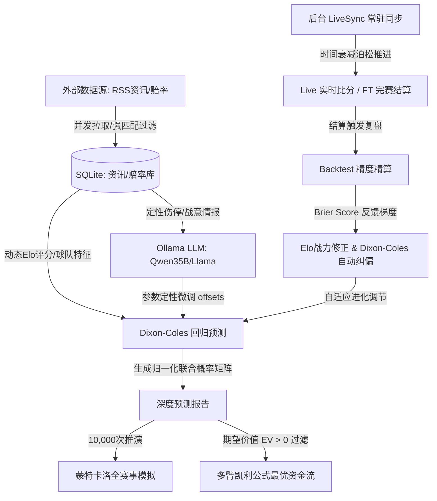

# 🏆 FIFA 2026 足球量化分析预测系统

<div align="left">

[](https://golang.org)
[](https://www.docker.com)
[](https://www.sqlite.org)
[](https://echarts.apache.org)

</div>

本项目是一款专为 **2026 世界杯** 打造的足球量化预测、大模型定性偏置修正及自动套利大屏分析系统。系统采用前后端分离架构，并在后台集成了基于赛程时间轴的实时数据演化推进、定性资讯大模型融合与预测精度在线自校准闭环。

---

## 🗺️ 系统数据流与预测校准闭环

为了直观展现系统各算法及数据模块的动态协作逻辑，系统整体闭环架构设计如下：



---

## 🌟 核心功能

> [!IMPORTANT]
> **1. 双变量泊松回归预测 (Dixon-Coles Engine)**
> - 采用经典的 **Dixon-Coles 算法** 计算两队期望进球率（$\lambda_H$, $\lambda_A$）及平局算子（$\rho$）。
> - 精算 6x6 比分概率矩阵，有效消除低分截断误差，输出胜平负无偏概率。

> [!TIP]
> **2. 混合型定性偏置修正 (AI Parameter Refiner)**
> - 自动提取 SQLite 中持久化的实时战术、天气、关键伤停情报（原生英文展示，零算力开销）。
> - 联动本地 **Ollama 实例** 智能解算定量模型偏置量，融合“定量数学”与“定性推理”。
> - **算力优化策略**：已彻底剥离外围情报大模型翻译功能，并释放了轻量级的 `qwen3:8b` 模型。本地 Ollama 专职且常驻加载高精度 `qwen3.6:35b-q4` 大模型，避免了频繁冷启动与切换，彻底消除了显存开销与超时导致的降级隐患。

> [!NOTE]
> **3. 布莱尔分数自适应反馈进化 (Online Parameter Tuning)**
> - 完赛时自动精算 **Brier Score (布莱尔分数)** 校验联合预测误差。
> - 依据布莱尔误差方向反推修正梯度，在线更新 `rhoOffset` 偏置，实现预测精准度随着完赛场次递增的**闭环自我进化**。

> [!WARNING]
> **4. 情报去噪声与物理持久化 (Anti-Hallucination Persistence)**
> - 并发抓取的全球 RSS 情报完全固化至 `news_articles`，剔除任何幻觉杜撰，全部提供能直达原文的**精准文章详情 URL**。
> - 所有的单场深度预测报告及概率矩阵自动归档至 `prediction_reports`。
> 
> [!TIP]
> **5. 多源比分共识同步与动态延迟防封 (Multi-Source Consensus & Adaptive Sync)**
> - **多源共识机制**：并发（Goroutine）抓取百度、LiveScore 与 CCTV 的数据，采取比分最大值合并与已完赛状态（`FT`）高优覆盖。支持对 CCTV 云盾安全挑战的自动检测与优雅降级容错。
> - **动态防封轮询**：有 `Live` 比赛时自动维持 60秒 频率，无比赛时自动降低为 10分钟 低频休眠，彻底消除被封 IP 的隐患。
> - **增量 DOM 零闪烁**：重构 SSE `/api/matches/stream` 即时广播，前端基于 `data-match-id` 原地增量更新比分和霓虹渐变背景，配合 JSON 数据指纹比对校验，实现零白屏晃动与零滚动条重置的极致大屏体验。


---

## 🛠️ 技术栈 (Technology Stack)

* **后端 (Backend)**：Go (1.22-alpine) 核心服务 / Gin Web 框架 / 跨平台纯 Go 驱动 SQLite。
* **算法模型 (Models)**：Dixon-Coles 回归 / 梯度自校准 / Shin 氏去抽水 / 二次规划多臂凯利公式。
* **大语言模型 (LLM)**：Ollama 容器连通（专精常驻高精度 `qwen3.6:35b-q4`，已彻底下线 8B 级轻量翻译模型，腾退显存）。
* **前端 (Frontend)**：HTML5 / 原生 CSS3 暗黑霓虹美学 / Vanilla JS (ES6) / ECharts (v5) 可视化。

---

## 📂 项目结构

```bash
├── README.md               # 项目客观描述与自述文件
├── Dockerfile              # 后端服务容器构建配置文件
├── docker-compose.yml      # 本地多服务编排拉起配置
├── data/
│   ├── db/                 # SQLite 数据库持久化目录 (git 排除)
│   └── seasons/            # 冷启动静态分组及球队历史特征配置
├── src/
│   ├── main.go             # Gin 后端路由与服务主入口
│   ├── frontend/           # 霓虹大屏前端展示资源 (html/css/js)
│   └── internal/
│       ├── db/             # SQLite 实体表交互层 (news/predictions/matches)
│       ├── models/         # 核心量化模型实体定义 (tournament/prediction)
│       └── service/        # 核心算法服务 (dixon_coles/live_sync/backtest/scraper)
```

---

## 🚀 快速启动

1. **服务启动**：
   ```bash
   docker compose up -d --build
   ```
2. **访问入口**：
   - 霓虹大屏主页：[http://localhost:20260](http://localhost:20260)
   - 容器将自动通过 `host.docker.internal:11434` 连接宿主机部署的本地大模型。
