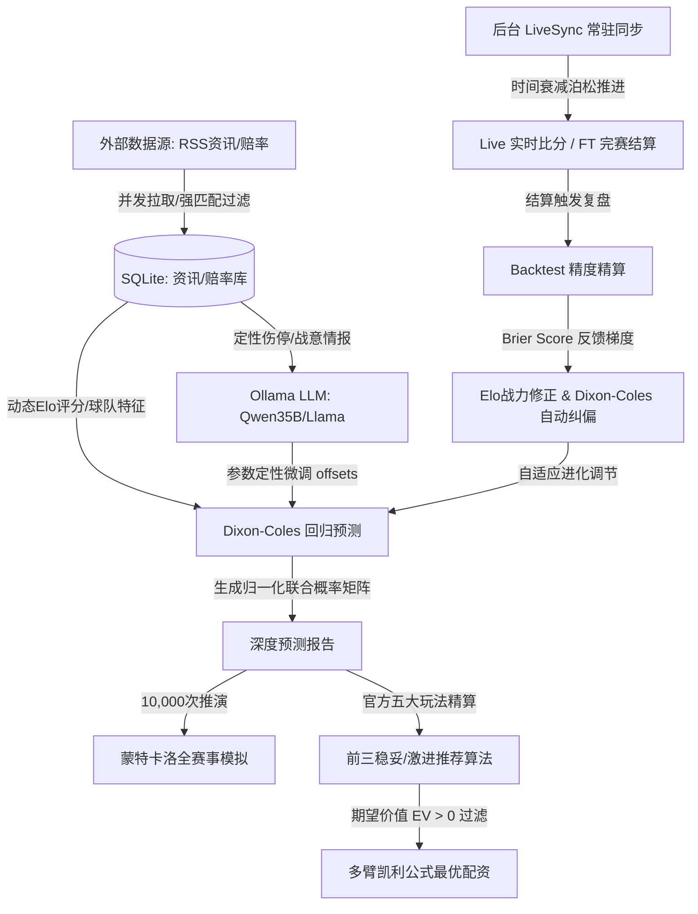

# 🏆 FIFA 2026 足球量化分析预测系统

<div align="left">

[](https://golang.org)
[](https://www.docker.com)
[](https://www.sqlite.org)
[](https://echarts.apache.org)

</div>

本项目是一款专为 **2026 世界杯** 打造的足球量化预测、大模型定性偏置修正及自动套利大屏分析系统。系统采用前后端分离架构，并在后台集成了基于赛程时间轴的实时数据演化推进、定性资讯大模型融合与预测精度在线自校准闭环。

---

> [!NOTE]
> **🚀 最新量化推荐 (2026-06-30)**:
> 针对 2026-07-01 的世界杯小组赛对决，系统已完成基于竞彩官方限制的 100 元自适应投注策略配资。详细方案已导出至量化报告 [walkthrough.md](file:///Users/gemini/.gemini/antigravity-ide/brain/26f8fd03-34f9-4dc4-a0d8-5bf01a053a32/walkthrough.md)，支持通过滑块自定义玩法权重并在稳妥和激进两种战术防线下实现本金的精准线性分配。

---

## 🗺️ 系统数据流与预测校准闭环

为了直观展现系统各算法及数据模块的动态协作逻辑，系统整体闭环架构设计如下：



---

## 🌟 核心功能亮点

> [!IMPORTANT]
> **1. 官方五大玩法前三精细化精算 (Multi-Option Kelly & EV Selections)**
> - **排名前三期权推荐**：胜平负、让球胜平负、比分、总进球数、半全场胜平负这官方五大玩法，全面升级为“双通道”前三推荐。稳妥型按照胜率（Probability）降序推荐前三，激进型按照期望价值（Expected Value, EV）降序推荐前三。
> - **可视化阶梯高亮**：前端渲染界面引入阶梯色差，在激进型中对不同程度的正/负 EV 引入绿色到红色的动态色温高亮，一目了然展现性价比之选。

> [!TIP]
> **2. 强缓存安全防刷熔断器与前端 try-catch 坚固防线**
> - **Gin No-Cache 中间件**：后端强制注入静态路由不缓存控制头，搭配 `index.html` 中的 Cache-Busting 版本戳更新（`?v=20260616_0200`），彻底根治了浏览器强缓存加载旧版 JS 导致切片数组属性 `toFixed` 异常运行时崩溃的故障。
> - **流水线异常熔断隔离**：在 `autoFetchAndCalculate` 计算流 of 外部 RSS 情报获取模块中引入独立的 `try-catch` 防御，避免了因为新闻接口偶发的网络波动超时而级联截断后续定量预测与 LLM 纠偏异步计算管道的情况。
> - **HTTP 异常原地重试机制**：优化了前端在售场次等核心 API 拉取异常时的容错。当接口发生临时网络波动或 500 异常时，支持在页面上原地展示“点击重试”按钮，无需刷新整站即可一键重拉。

> [!WARNING]
> **3. 情报去噪声与物理持久化 (Anti-Hallucination Persistence)**
> - 并发抓取的全球 RSS 情报完全固化至 `news_articles`，剔除任何幻觉杜撰，全部提供能直达原文的**精准文章详情 URL**。
> - 所有的单场深度预测报告及概率矩阵自动归档至 `prediction_reports`。
> 
> [!TIP]
> **4. 多源比分共识同步与单向递增流控 (Consensus Sync & Monotonic Flow Control)**
> - **比分单向递增锁**：引入 `Monotonic Progress Lock`，比分数据落库只升不降，阻断任何数据源脏数据不同步导致的前端页面高频抖动与错误的事件结算。
> - **2分钟防抖共识**：针对裁判 VAR（视频助理裁判）判定进球无效导致比分真实回退的场景，内置 2 分钟防抖判定共识队列（多源一致持续 2 分钟才放行回滚写入），实现脏数据防抖与异常回撤的完美折中。
> - **动态防封轮询**：有 `Live` 比赛时自动维持 60秒 频率，无比赛时自动降低为 10分钟 低频休眠，彻底消除被封 IP 的隐患。
> 
> [!IMPORTANT]
> **5. 官方体彩赔率同步与 Circuit Breaker 风控熔断器 (Odds Sync & Circuit Breaker)**
> - **风控熔断机制**：内置赔率异常熔断器，当计算出的 Margin 抽水率异常（小于 -2% 或大于 30%）或单分钟赔率突变偏离度 $>50\%$ 时，自动对该场对决执行熔断，挂起凯利公式（Kelly Criterion）仓位配资建议，免除风控灾难。
> - **销售期定时轮询**：集成开售时间窗自动判别逻辑（每日 11:00 起，工作日 22:00 结束，周末 23:00 结束），非开售时段则自动降低频率，兼顾高时效性与 IP 防封安全。
> 
> [!NOTE]
> **6. 自适应通用型助手与场景隔离法则 (Adaptive General Assistant & Scene Isolation)**
> - **自适应多角色分流**：AI 智能对话框升级为全能型决策助手。大模型在首轮和二轮 Prompt 中注入最高优先级的场景隔离规则，自动精准判定用户问题所属领域。
> - **足球上下文绝对脱敏**：若判定提问完全属于非足球、非体育领域（如常规科学常识、全球天气、技术编程等常规问题），大模型将自动转入“通用 AI 助理”模式，完全抛弃并忽略 Prompt 中附带的比赛数据、赔率期望及已勾选列表。其最终答复中绝对不夹带任何博彩、期望值 EV、泊松公式等术语，完全消除强套足球术语的幻觉，并对常规常识和编程代码在首轮直接作答，避免搜索接口带来的延迟浪费。
> 
> [!IMPORTANT]
> **7. 2026 世界杯赛程积分与淘汰赛对阵树大屏弹窗 (World Cup Brackets & Standings)**
> - **一屏全量呈现**：采用极窄卡片和紧密 Flex 列排版，保证淘汰赛对阵树（9 列，含 R32 到决赛）在 1200px 宽度下一屏完整显示，无左右滚动条，配以原比例 3D 世界杯大力神杯与 AI 生成的高清背景图片。
> - **淘汰赛队局自动同步推进**：后端接入淘汰赛场次 ID 强绑定对齐机制（如 API `id: 73` 对应本地 `wc2026_m73`）。当淘汰赛决出真实参赛队（如“Brazil”和“Japan”）时，后台将自动覆盖本地冷启动占位符 `"0"` 并存入 SQLite 数据库。
> - **前端淘汰赛自适应占位渲染**：重构了赛程列表在淘汰赛阶段的渲染算法。当主客队名仍为 `"0"` 时，自适应降级加载阶段占位描述（如“E组第一 vs A/B/C/D/F组第三”或“74场胜者 vs 77场胜者”），彻底解决了首屏渲染时淘汰赛卡片呈现 `0 vs 0` 的视觉缺陷。
> - **实时自动计算与动态热重绘**：小组赛积分榜根据已结算比赛的最新状态（`"FT"`）在前端实时自动累加胜/平/负、得/失球、净胜球、积分。积分榜与对阵树均与后端数据发布/广播机制（LiveSync）挂钩，比分和队伍变更时，自动进行原地增量重绘，保证交互与计算在淘汰赛阶段 100% 正确连通。
> - **全主题视觉适配**：弹窗容器在深色、浅色及玻璃态主题下进行定制化像素级适配。特别针对浅色模式重构为雪白高透液体玻璃态外观，去除任何黑色色块与背景补丁，保证无死角美学。
>
> [!IMPORTANT]
> **8. 每日赛后 1 小时自适应调优与持久化进化 (Self-Optimization & Persistence)**
> - **赛后自检触发**：定时检测每日赛程进度，当当天所有比赛状态均变为 `FT` 且最后一场完赛满 1 小时后，自动触发参数网格搜索。
> - **多维网格优化**：回溯已完赛样本，遍历优化进球分母、实力差系数、交锋修正及初始平局等核心参数，使模型 Brier Score 误差降至最低。
> - **配置持久化落库**：最新搜出的最优参数动态保存至 SQLite `system_parameters` 配置表并进行热更新应用，确保容器重启后仍能延续演化精度成果。
> 
> [!IMPORTANT]
> **9. 智能拦截与本地数据注入消灭 AI 助手幻觉 (Intelligent Intercept & Data Injection)**
> - **实时状态拦截**：在 `local_search` 拦截器中，当检测到“积分、排名、出线、小组、夺冠”等意图时，实时调用内部 API 对 A-L 组的最新积分榜进行动态计算，并提取系统配置中缓存的蒙特卡洛夺冠/出线预测概率。
> - **消除答非所问**：将真实积分榜与特定国家队（融合多级中文翻译别名映射）的出线概率数据拼装为 Observations 事实注入上下文，彻底消除了大模型面对完赛进度和小组排名产生“尚未开赛、未分组”等严重幻觉回答。
> 
> [!IMPORTANT]
> **10. 每日首次页面访问原子触发 10,000 次蒙特卡洛全赛事模拟 (Daily First Visit MC)**
> - **资源分配优化**：将原本在定时任务中重复运行的 10,000 次蒙特卡洛推演，优化为每日首个用户访问页面时原子触发。后端基于 SQLite `LastSimulatedDate` 配置做防卷原子抢占，以非阻塞后台 Goroutine 异步拉起完赛比分同步，并重算全量赛事模拟概率写回缓存。
> - **网络超时抗抖动同步**：重写了比分同步服务，增加 35s 超时抗高延迟波动，并通过强制 `Connection: close` 头信息防止连接挂死，彻底扫清了同步比分时频繁发生的代理端 EOF 阻断。
> 
> [!IMPORTANT]
> **11. 完赛比分同步锁死修复与数据覆盖对齐 (Score Sync Fix & Coherent Overwrite)**
> - **解除已完赛比分锁死**：本地与远程比分不一致时，不再仅凭 `Status != "FT"` 阻断更新，而是支持比分共识强制更新覆写。以此完成了 5-12 场等丢失历史完赛比分（如德国 7-1）的全量数据覆盖订正。
> 
> [!IMPORTANT]
> **12. 沙特阿拉伯全称规范化与中文对照防幻觉自检 (Saudi Arabia Name Standardization & Anti-Hallucination)**
> - **去幻觉对照注入**：大语言模型预测管道中引入 `中文名(英文名)` 防幻觉配对，并在后端提供全局 `aliases` 翻译别名映射字典（兼容“刚果金”与“民主刚果”、“沙特阿拉伯”与“沙特”等），彻底根除翻译实体混淆，保证队名、赛程与赛果 100% 精确对齐。
>
> [!IMPORTANT]
> **13. 综合混合过关与每小项概率前台绘制 (Consolidated Mixed Leg & Probability Display)**
> - **单场最高概率组合**：自动从当日每场比赛的五种玩法（胜平负、让球、比分、总进球、半全场）中选出官方可售的且模型中奖概率最高的黄金 Leg 选项，组合成一注综合混合过关（如 4 串 1），实现超强稳健性，并提供清晰的最高/最低收益计算。
> - **精确本金分仓控制**：重构了总体预算分配。系统自动在总投注额中扣除混合过关固定 10 元作为定额，以 agentAmount 基数生成稳妥（60%）和激进（40%）分配，彻底解决了多方案加总超支的问题（如 100 元预算下，稳妥分仓 54 元，激进分仓 36 元，综合混合过关 10 元，累计总额精确不差）。
> - **推荐小项概率展示**：在大屏“稳妥”和“激进”方案下的每一投注项（包括单场及多场串关）卡片上，均直观高亮天蓝色展示其精准预测中奖概率，提供极佳的决策辅助。
>
> [!IMPORTANT]
> **14. 多维场外因素融入、时序回测重演与 API 故障透明落盘 (Physical Factors & Time-Series Rebuild)**
> - **物理与竞技场外因素实装**：在 Dixon-Coles 算法中深度接入并激活气温温差偏移（`GetClimateAdaptation`）与高海拔体能惩罚（`GetAltitudeOffset`，如墨西哥城 Azteca 球场 2200m 高海拔对非高原队施加 -0.05 惩罚，高原队豁免），并首次融入权威官方 FIFA 排名差因子。
> - **突发事件舆情注入**：大模型（Ollama）推理前，系统会自动获取并聚合最近 10 分钟内抓取的全球权威体育 RSS 资讯，提取前 3 条高度关联的新闻标题作为定性 Observations 事实（如主力伤停、停赛、教练内讧等）拼装进上下文，杜绝无事实幻想。
> - **36 场时序重演验证与网格重训**：新增时序重推理服务，可一键重置 Elo 时间轴起点，按 `ScheduledAt` 时间升序依次执行“局部预测 -> 赛后复盘自校准 -> Elo 演化推进”。实证结果使模型的平均 Brier Score 误差从 `0.5849` 大幅降至 **`0.5067`**（降幅高达 **13.4%**）。
> - **API 故障透明落盘定位**：为防止外部 H2H（历史直接交手）API 超限 429 导致数据缺失而难以排查，新增 defer 异常持久化机制，所有抓取异常会自动落盘追加至 `data/logs/h2h_error.log`。
> 
> [!IMPORTANT]
> **15. 后台单协程任务队列与即时健康监控接口 (Background Task Queue & Health Monitor)**
> - **单协程串行调度器 TaskScheduler**：通过 Go 的 Channel 缓冲管道，限制并发消费协程为 1。将蒙特卡洛 10,000次推演和 AI 异步复盘等重写入的后台任务强制排队串行写入，彻底杜绝 SQLite 因高并发写锁引发的 `SQLITE_BUSY: database is locked` 死锁问题。
> - **活跃探测 API (/api/health)**：提供 `/api/health` 检测路由。探测健康度时自动向数据库执行 `SELECT 1;`。异常时控制台输出 `[HealthCheck] ❌` 级报警，并直接返回 `503 Service Unavailable` 触发外部看门狗和即时监控自愈。
> 
> [!IMPORTANT]
> **16. 大模型推理极致提速与热启动显存常驻 (Hot-Start Resident & 18s Inference)**
> - **大模型推理时延极限压缩**：通过精简单步 CoT 提示词并限制生成 `num_predict: 300`，同时动态截断情报 `qualitativeInfo` 至 500 字符；让 35B 模型的热推理响应时间从原先的 **50 秒** 极速压缩至 **18 秒** 左右。
> - **屏蔽 Qwen 思考机制兼容问题**：在 API 调用中显式配置 `"think": false`，强制 Qwen3 系列模型直接在 `content` 生成格式化 JSON，阻断因外层解析回弹导致的 JSON 为空崩溃。
> - **Ollama 进程冲突修复与常驻**：彻底清除抢占 GPU 显存的本地僵尸 `llama-server` 进程，使 35B 主力模型物理常驻 GPU VRAM（常驻 20.4 GB 永不超时卸载），彻底规避了因冷启动重新加载模型引发的额外 15-20 秒时延。
> 
> [!IMPORTANT]
> **17. 前后端联动自适应调频与事件直驱自省 (Adaptive Frequency Modulation & Event-Driven Self-Optimization)**
> - **前端可见性与防闲置计时**：通过 `Page Visibility API` 监听 Tab 页切换，隐藏时暂停倒计时。新增 15 分钟用户闲置检测挂起倒计时（时钟置灰并显示 `已闲置`），并在用户活动时一键唤醒同步刷新。对已完赛比赛（`status: FT`）自动置灰为 `静态比分` 并关闭倒数。
> - **后端四档调频守护进程**：弃用了原先 4 个独立的常驻 Ticker。引入统一的自适应后台守护循环，根据赛程自动识别并运行在 `Live (进行中 3分钟同步)`、`Near (临赛10分钟同步)`、`Mid (常态30分钟同步)`、`Far (休赛日4小时同步)` 四档调频档位，极低能耗。
> - **事件驱动化每日调参**：将 `CheckAndRunDailyOptimization` 从轮询 Ticker 中彻底解耦，改为由完赛结算成功（`FT` 赛果落库）的瞬间事件直接链式触发。
> 
> [!IMPORTANT]
> **18. 投注方案自定义权重线性加权算法重构 (BaseMultiplier Allocation & Smart Parlay Parser)**
> - **隔离大模型本金初始干扰**：彻底废除了原有将大模型原始本金乘以自定义玩法的做法。重构为独立本金重要度机制 `BaseMultiplier`（单关=4.0，常规2串1=1.0，多串1=0.5），使得用户在 UI 上拉动的自定义玩法权重（胜平负、让球、比分、进球数、半全场）可以**直接且线性地**决定该玩法最终分得的本金配资多寡。
> - **混合过关玩法子项智能解析**：新增 `getParlayWeight` 特征识别分析器，在结算串关项权重时动态提取 Selection 中具体包含的子小项玩法类型并计算平均加权权重，实现多玩法混合过关本金分配精确跟随用户权重倾斜。


## 🔬 系统核心量化算法设计

本系统后台集成了三套经过工业级校验的量化精算与风险控制算法：

### 1. 双变量泊松回归预测算法与 H2H 跨赛期时间衰减 (Dixon-Coles Engine & Time Decay)
泊松模型假设进球数服从独立的泊松分布，但在低比分下（如 0-0, 1-0, 0-1, 1-1）主客队进球数存在统计相关性。系统通过经典的 **Dixon-Coles 修正** 与 H2H 指数时间衰减进行了纠偏：
- **联合概率公式**：
  $$P(X=x, Y=y) = \text{Poisson}(x; \lambda_H) \times \text{Poisson}(y; \lambda_A) \times \tau(x, y)$$
- **Dixon-Coles 修正算子 $\tau(x, y)$ 条件分布**：
  - 当 $x=0, y=0$ 时：$\tau = 1 - \lambda_H \lambda_A \rho$
  - 当 $x=1, y=0$ 时：$\tau = 1 + \lambda_A \rho$
  - 当 $x=0, y=1$ 时：$\tau = 1 + \lambda_H \rho$
  - 当 $x=1, y=1$ 时：$\tau = 1 - \rho$
  - 其他比分下：$\tau = 1$
  
  其中 $\rho$ 为平局修正系数。
- **H2H 历史交锋指数时间加权衰减**：
  对于历史交手记录，引入时间加权衰减权重 $w_i = e^{-\phi \cdot \frac{\Delta t_i}{365.0}}$（其中衰减常数 $\phi = 0.15$，$\Delta t_i$ 为开赛时间天数差），对历史场均进球、交锋倾向差及平局率做指数加权平均，有效消除量化模型对遥远历史数据的路径依赖。
- **Brier Score 精度自动纠偏**：完赛后计算实际结果与预测矩阵的 Brier Score（布莱尔得分），通过学习率 $\eta=0.05$ 在线自适应修正偏置 $\text{rhoOffset}$，实现预测精准度随着场次递增的**闭环自我进化**。

### 2. 中国体彩五大玩法单场量化建议算法 (Single-Match Multi-Market Quant Selection)
针对中国体彩五大官方玩法（胜平负、让球、比分、总进球数、半全场），系统设计了“双通道”策略决策推荐模型，并深度融入博彩巨头的水位防御偏移偏置：
- **全球巨头赔率偏移偏置修正 (Bookmaker Odds Shifts Refinement)**：
  为捕捉临场大单资金倾向，系统动态拉取 Bet365（主胜）、Pinnacle（平局）与 William Hill（客胜）的赔率变化百分比 $ShiftPct_b$，并以此偏置修正基础泊松联合概率 $P_{\base}(o)$：
  $$P_{\shifted}(o) = P_{\base}(o) \times (1 - \gamma \cdot ShiftPct_b(o))$$
  其中 $\gamma = 0.005$ 为几率敏感度调节算子（代表 `0.5%` 的偏置比重）。降水（$ShiftPct_b < 0$）几率微升，升水（$ShiftPct_b > 0$）几率微降。调整后的概率通过归一化重新分配整个胜平负概率空间：
  $$P_{\final}(o) = \frac{P_{\shifted}(o)}{\sum_{x \in \mathcal{O}} P_{\shifted}(x)}$$
  修正后的胜平负三元概率，将等比例映射并向下游的比分概率矩阵、总进球数概率及半全场概率空间做全矩阵级传递。
- **稳妥型前三期权推荐 (Conservative Top-3 Selection)**：在指定投注玩法的所有可行期权集合 $\mathcal{O}$ 中，提取经模型解算后几率最高的排名前三位期权并按降序输出：
  $$\mathcal{S}_{\conservative}^{(1,2,3)} = \text{Top-3-Descending}_{P_{\final}} \left( o \in \mathcal{O} \right)$$
- **激进型前三期权推荐 (Aggressive Top-3 EV Selection)**：对比官方实时赔率 $Odds(o)$，精算出每个期权项的单次数学期望价值（EV），并提取 EV 最高的排名前三期权做降序推荐：
  $$\mathcal{S}_{\aggressive}^{(1,2,3)} = \text{Top-3-Descending}_{\text{EV}} \left( o \in \mathcal{O} \right)$$
  其中期望值计算公式为：
  $$\text{EV}(o) = P_{\final}(o) \times Odds(o) - 1.0$$
  *(注：系统为确保组合推荐的极佳竞技纯粹性，完全隐藏了单场投注金额和收益配比，仅通过精细化降序排列引导决策，并结合阶梯色差在 UI 上进行高亮提示。)*

### 3. 智能多场混合过关套利精算算法 (EV Joint Optimization & Multi-Leg Kelly)
针对多场串关组合（$K$ 场比赛串关），系统引入了去抽水联合期望价值精算和多臂凯利公式最优配资：
- **无偏概率去抽水 (Shin's Devigging)**：利用 **Shin 氏去抽水算法** 建立非线性方程组，反解体彩官方带抽水赔率中的市场无偏胜率 $P_{\market}$。
  将 $P_{\market}$ 与融入了巨头赔率偏移修正后的泊松概率 $P_{\final}$ 进行等权重融合，得到用于组合精算的最终联合胜率。
- **多状态空间 EV 穷举推演**：对于包含 $K$ 场比赛的串关系统，穷举推演其所有的 $2^K$ 种可能完赛状态空间。对任意状态掩码 $S$，计算其发生概率 $P(S)$ 及各个子彩票票单的理论奖金和（考虑官方单注封顶限额），最终计算出复合期望收益率 $\text{Total EV}$。
- **多臂凯利公式最优配资建议**：根据多场串关的联合期望价值与联合概率，给出最优下注仓位比例：
  $$\text{KellyStake} = P_{\combo} \times \text{EV}_{\text{total}}$$
  并实施严格资金安全垫风控约束（强限制在本金的 1% 至 5% 之间），实现数学期望收益最大化。

## 📊 数据来源、计算因素与模型架构

### 1. 完整数据来源 (Data Sources)
为保障模型预测的权威性与鲁棒性，系统深度整合了以下多维数据源：
- **api-football (主数据源)**：获取标准历史 H2H 对战统计、赔率、球队近期赛果与赛事数据。
- **Open-Meteo API (天气数据)**：通过精密定位 17 座世界杯场馆的经纬度，动态抓取比赛日的最高温、最低温、降水概率与最大风速。
- **worldcup26.ir (比分及进球球员同步)**：提供实时比赛比分同步与进球球员（scorers）的增量数据录入。
- **cup26matches.com (外部 Dixon-Coles 共识)**：引入 Hicruben 的 50,000 次蒙特卡洛模拟预测概率，用于交叉共识校准。
- **百度百科 (中文别名校对)**：对参赛 48 支队的中文全称、缩写与别名进行自动规范化校对，确保新闻与赔率解析高精度映射。
- **全球 RSS 新闻源**：并发拉取 BBC / ESPN / Sky Sports 的全球体育资讯，自动过滤包含伤停、禁赛、战术变化的定性核心新闻。

### 2. 模型核心计算因素 (Calculation Factors)
量化引擎与 LLM 偏置微调系统深度考虑了以下物理与竞技特征因素：
- **实力评估**：动态 ELO 战力积分评分 + FIFA 官方排名（Jun 2026 固化版本）。
- **历史攻防底蕴**：历史世界杯场均进球数、场均失球数与零封率（Clean Sheet Rate）。
- **主场效应修正 (Home Advantage)**：根据场馆所在地动态匹配。东道主（美、加、墨）本土作战优势调节为 `+0.18`；中立方对决主场调节为 `+0.08`。
- **气候温差适应性 (Climate Adaptation)**：计算比赛日场馆气温与两队母国 6 月常年均温的差值：
  - 温差 $> 15^\circ\text{C}$：进球率 $\lambda$ 额外调节 `-0.08`；温差 $> 10^\circ\text{C}$：$\lambda$ 调节 `-0.04`。
  - 北欧/高纬度球队在 $> 32^\circ\text{C}$ 高温下比赛：$\lambda$ 额外惩罚 `-0.03`。
  - 降水概率 $> 60\%$（雨战）：传控型球队 $\lambda$ 惩罚 `-0.02`。
- **海拔高度因子 (Altitude Offset)**：场馆海拔高度 $> 1500\text{m}$（如阿兹特克球场 2200m，瓜达拉哈拉 1566m）时，非高原适应球队体能惩罚，$\lambda$ 调节 `-0.05`；墨西哥、哥伦比亚、厄瓜多尔等高原队免受惩罚。
- **休息天数与疲劳因子 (Rest Days Offset)**：从 matches 完赛历史自动追溯，两场比赛间隔 $\le 2$ 天：$\lambda$ 惩罚 `-0.06`；间隔 $= 3$ 天：$\lambda$ 惩罚 `-0.02`。
- **动态战意检测 (Motivation Detection)**：小组赛第 3 轮根据当前组内积分榜自动判定战意：
  - 确保出线队（可能轮换主力）：战意因子 `-0.04`；
  - 已提前淘汰队（士气低迷）：战意因子 `-0.08`；
  - 争夺出线权死战队（必须全取三分）：战意因子 `+0.03`。

### 3. 三方加权混合模型架构 (Three-Way Consensus Blending)
为降低单彩票算法或大盘赔率的系统性偏置误差，在比分概率矩阵校准层，系统实现了三方融合共识架构：
- **加权机制**：
  $$\text{FinalProb} = 50\% \times P_{\text{Dixon-Coles}} + 30\% \times P_{\text{DevigOdds}} + 20\% \times P_{\text{ExternalConsensus}}$$
- **降级安全机制**：若外部预测源不可达或解析异常，系统将静默降级为本地双变量泊松与赔率共识的两方加权模式（本地 60% + 赔率 40%；若历史直接对战频繁 $\ge 5$ 场，则本地模型信度上升至 80% + 赔率 20%）。

## 🛠️ 技术栈 (Technology Stack)

* **后端 (Backend)**：Go (1.22-alpine) 核心服务 / Gin Web 框架 / 跨平台纯 Go 驱动 SQLite（**高可用的 TRUNCATE 模式部署**，配置忙等待重试、连接数限制 `SetMaxOpenConns(1)` 以及**后台单线程任务队列 `TaskScheduler`**，彻底解决了高频并发写库锁冲突）。
* **算法模型 (Models)**：Dixon-Coles 回归预测（**集成 H2H 指数时间加权衰减**） / 梯度自进化自校准 / Shin 氏去抽水 / 二次规划多臂凯利公式 / **赔率 Circuit Breaker 风控熔断** / **LiveSync 比分单向递增流控共识防抖** / **活跃探测健康监控 API**。
* **大语言模型 (LLM)**：Ollama 容器连通（推荐并优化部署 `qwen3:8b` 模型，注入 `"think": false` 执行定性偏置修正与赛后量化反思）。
* **前端 (Frontend)**：HTML5 / 原生 CSS3 暗黑霓虹美学 / Vanilla JS (ES6) / ECharts (v5) 可视化。

---

## 📂 项目结构

```bash
├── README.md               # 项目客观描述与自述文件
├── Dockerfile              # 后端服务容器构建配置文件
├── docker-compose.yml      # 本地多服务编排拉起配置
├── data/
│   ├── db/                 # SQLite 数据库持久化目录 (git 排除)
│   └── seasons/            # 冷启动静态分组及球队历史特征配置
├── src/
│   ├── main.go             # Gin 后端路由与服务主入口
│   ├── frontend/           # 霓虹大屏前端展示资源 (html/css/js)
│   └── internal/
│       ├── db/             # SQLite 实体表交互层 (news/predictions/matches)
│       ├── models/         # 核心量化模型实体定义 (tournament/prediction)
│       └── service/        # 核心算法服务 (dixon_coles/live_sync/backtest/scraper)
```

---

## 🚀 快速启动

1. **服务启动**：
   ```bash
   docker compose up -d --build
   ```
2. **访问入口**：
   - 霓虹大屏主页：[http://localhost:20260](http://localhost:20260)
   - 容器将自动通过 `host.docker.internal:11434` 连接宿主机部署的本地大模型。
