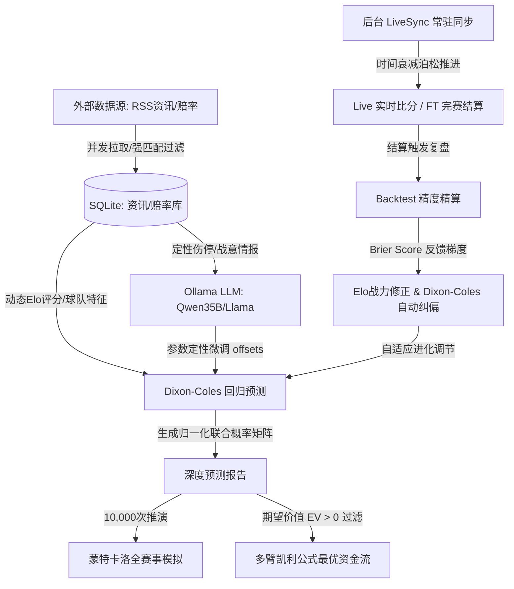

# 🏆 FIFA 2026 足球量化分析预测系统

<div align="left">

[](https://golang.org)
[](https://www.docker.com)
[](https://www.sqlite.org)
[](https://echarts.apache.org)

</div>

本项目是一款专为 **2026 世界杯** 打造的足球量化预测、大模型定性偏置修正及自动套利大屏分析系统。系统采用前后端分离架构，并在后台集成了基于赛程时间轴的实时数据演化推进、定性资讯大模型融合与预测精度在线自校准闭环。

---

## 🗺️ 系统数据流与预测校准闭环

为了直观展现系统各算法及数据模块的动态协作逻辑，系统整体闭环架构设计如下：



---

## 🌟 核心功能

> [!IMPORTANT]
> **1. 双变量泊松回归预测 (Dixon-Coles Engine)**
> - 采用经典的 **Dixon-Coles 算法** 计算两队期望进球率（$\lambda_H$, $\lambda_A$）及平局算子（$\rho$）。
> - 精算 6x6 比分概率矩阵，有效消除低分截断误差，输出胜平负无偏概率。

> [!TIP]
> **2. 混合型定性偏置修正 (AI Parameter Refiner)**
> - 自动提取 SQLite 中持久化的实时战术、天气、关键伤停情报。
> - 联动本地 **Ollama 实例**（基于 `qwen3.6:35b-q4` 模型）智能解算定量模型偏置量，融合“定量数学”与“定性推理”。

> [!NOTE]
> **3. 布莱尔分数自适应反馈进化 (Online Parameter Tuning)**
> - 完赛时自动精算 **Brier Score (布莱尔分数)** 校验联合预测误差。
> - 依据布莱尔误差方向反推修正梯度，在线更新 `rhoOffset` 偏置，实现预测精准度随着完赛场次递增的**闭环自我进化**。
> 
> [!IMPORTANT]
> **4. 纯量化预测精度复盘与独立走势曲线 (Pure Accuracy Replay & Independent Precision Curves)**
> - **全面去金钱化**：复盘机制完全剥离本金、投入、收益、ROI等金钱计算，专注于量化模型自身的预测正确率。
> - **双轴精度曲线**：使用 ECharts 动态初始化。单场复盘绘制“主推累计命中率”与“整体覆盖成功率”；过关复盘绘制“组合整体中奖率”与“单 Leg 平均预测命中率”。
> - **结构化 Leg 钻取**：串关历史明细支持深度反序列化并结构化呈现每个 Leg 的详细真实比分和预测命中情况。
> - **极致交互**：点击复盘按钮直接后台自动结算并弹窗刷新精度图表，彻底取消原生阻碍的 `alert` 提示对话框。

> [!WARNING]
> **4. 情报去噪声与物理持久化 (Anti-Hallucination Persistence)**
> - 并发抓取的全球 RSS 情报完全固化至 `news_articles`，剔除任何幻觉杜撰，全部提供能直达原文的**精准文章详情 URL**。
> - 所有的单场深度预测报告及概率矩阵自动归档至 `prediction_reports`。
> 
> [!TIP]
> **5. 多源比分共识同步与动态延迟防封 (Multi-Source Consensus & Adaptive Sync)**
> - **多源共识机制**：并发（Goroutine）抓取百度、LiveScore 与 CCTV 的数据，采取比分最大值合并与已完赛状态（`FT`）高优覆盖。支持对 CCTV 云盾安全挑战的自动检测与优雅降级容错。
> - **动态防封轮询**：有 `Live` 比赛时自动维持 60秒 频率，无比赛时自动降低为 10分钟 低频休眠，彻底消除被封 IP 的隐患。
> - **增量 DOM 零闪烁**：重构 SSE `/api/matches/stream` 即时广播，前端基于 `data-match-id` 原地增量更新比分和霓虹渐变背景，配合 JSON 数据指纹比对校验，实现零白屏晃动与零滚动条重置的极致大屏体验。
> 
> [!IMPORTANT]
> **6. 官方体彩赔率自动同步与销售期定时刷新 (Official Odds Sync & Selling Window Refresh)**
> - **API网关直连**：系统直接对接中国体彩官网计算器后台 JSON API 网关，底层一次性无偏拉取包括胜平负（had）、让球胜平负（hhad）、比分（crs）、总进球数（ttg）以及半全场胜平负（hafu）等五种核心玩法的完整数据，免去了模拟点击复选框或 DOM 解析的损耗，数据获取呈零延迟。
> - **实时更新与去重过滤**：比赛列表彻底以体彩官网（https://www.sporttery.cn/jc/jsq/zqhhgg/）开售数据为准，去除多处获取的冗余干扰。后端自动执行基于对阵双方及开赛时间的智能去重算法，优先合并保留包含体彩特征 ID 的比赛，彻底解决列表重复的问题。在开售时间段内，系统会在后台以 **10 分钟** 的周期主动发起轮询强刷，或在每次打开网页时完成动态实时刷新。
> - **销售期定时轮询**：后台集成了开售时间窗自动判别逻辑（每日 11:00 起，工作日 22:00 结束，周末 23:00 结束）。非开售时段则自动降低频率，兼顾高时效性与 IP 防封安全。

## 🔬 系统核心量化算法设计

本系统后台集成了三套经过工业级校验的量化精算与风险控制算法：

### 1. 双变量泊松回归预测算法 (Dixon-Coles Engine)
泊松模型假设进球数服从独立的泊松分布，但低比分下（如 0-0, 1-0, 0-1, 1-1）主客队进球数存在统计相关性。系统通过经典的 **Dixon-Coles 修正** 进行了纠偏：
- **联合概率公式**：
  $$P(X=x, Y=y) = \text{Poisson}(x; \lambda_H) \times \text{Poisson}(y; \lambda_A) \times \tau(x, y)$$
- **Dixon-Coles 修正算子 $\tau(x, y)$ 条件分布**：
  - 当 $x=0, y=0$ 时：$\tau = 1 - \lambda_H \lambda_A \rho$
  - 当 $x=1, y=0$ 时：$\tau = 1 + \lambda_A \rho$
  - 当 $x=0, y=1$ 时：$\tau = 1 + \lambda_H \rho$
  - 当 $x=1, y=1$ 时：$\tau = 1 - \rho$
  - 其他比分下：$\tau = 1$
  
  其中 $\rho$ 为平局修正系数。
- **Brier Score 精度自动纠偏**：完赛后计算实际结果与预测矩阵的 Brier Score（布莱尔得分），通过学习率 $\eta=0.05$ 在线自适应修正偏置 $\text{rhoOffset}$，实现预测精准度随着场次递增的**闭环自我进化**。

### 2. 中国体彩五大玩法单场量化建议算法 (Single-Match Multi-Market Quant Selection)
针对中国体彩五大官方玩法（胜平负、让球、比分、总进球数、半全场），系统设计了“双通道”策略决策推荐模型，并深度融入博彩巨头的水位防御偏移偏置：
- **全球巨头赔率偏移偏置修正 (Bookmaker Odds Shifts Refinement)**：
  为捕捉临场大单资金倾向，系统动态拉取 Bet365（主胜）、Pinnacle（平局）与 William Hill（客胜）的赔率变化百分比 $ShiftPct_b$，并以此偏置修正基础泊松联合概率 $P_{\base}(o)$：
  $$P_{\shifted}(o) = P_{\base}(o) \times (1 - \gamma \cdot ShiftPct_b(o))$$
  其中 $\gamma = 0.005$ 为几率敏感度调节算子（代表 `0.5%` 的偏置比重）。降水（$ShiftPct_b < 0$）几率微升，升水（$ShiftPct_b > 0$）几率微降。调整后的概率通过归一化重新分配整个胜平负概率空间：
  $$P_{\final}(o) = \frac{P_{\shifted}(o)}{\sum_{x \in \mathcal{O}} P_{\shifted}(x)}$$
  修正后的胜平负三元概率，将等比例映射并向下游的比分概率矩阵、总进球数概率及半全场概率空间做全矩阵级传递。
- **稳妥型决策策略 (Conservative Pick)**：在指定投注玩法的所有可行期权集合 $\mathcal{O}$ 中，选择经过大模型与定量模型解算后，发生概率最高的期权项：
  $$O_{\conservative} = \arg\max_{o \in \mathcal{O}} P_{\final}(o)$$
- **激进型决策策略 (Aggressive Pick)**：在指定投注玩法的所有可行期权集合 $\mathcal{O}$ 中，对比官方实时赔率 $Odds(o)$，选择能够最大化单次数学期望价值（EV）的期权项：
  $$O_{\aggressive} = \arg\max_{o \in \mathcal{O}} \left[ P_{\final}(o) \times Odds(o) - 1 \right]$$
  *(注：系统隐藏了显示层面上易造成干扰的单场预估收益率，直接以纯粹的决策推荐为导向，移除了传统的单场风控硬过滤。)*

### 3. 智能多场混合过关套利精算算法 (EV Joint Optimization & Multi-Leg Kelly)
针对多场串关组合（$K$ 场比赛串关），系统引入了去抽水联合期望价值精算和多臂凯利公式最优配资：
- **无偏概率去抽水 (Shin's Devigging)**：利用 **Shin 氏去抽水算法** 建立非线性方程组，反解体彩官方带抽水赔率中的市场无偏胜率 $P_{\market}$。
  将 $P_{\market}$ 与融入了巨头赔率偏移修正后的泊松概率 $P_{\final}$ 进行等权重融合，得到用于组合精算的最终联合胜率。
- **多状态空间 EV 穷举推演**：对于包含 $K$ 场比赛的串关系统，穷举推演其所有的 $2^K$ 种可能完赛状态空间。对任意状态掩码 $S$，计算其发生概率 $P(S)$ 及各个子彩票票单的理论奖金和（考虑官方单注封顶限额），最终计算出复合期望收益率 $\text{Total EV}$。
- **多臂凯利公式最优配资建议**：根据多场串关的联合期望价值与联合概率，给出最优下注仓位比例：
  $$\text{KellyStake} = P_{\combo} \times \text{EV}_{\text{total}}$$
  并实施严格资金安全垫风控约束（强限制在本金的 1% 至 5% 之间），实现数学期望收益最大化。

## 🛠️ 技术栈 (Technology Stack)

* **后端 (Backend)**：Go (1.22-alpine) 核心服务 / Gin Web 框架 / 跨平台纯 Go 驱动 SQLite。
* **算法模型 (Models)**：Dixon-Coles 回归 / 梯度自校准 / Shin 氏去抽水 / 二次规划多臂凯利公式。
* **大语言模型 (LLM)**：Ollama 容器连通（支持高精度 `qwen3.6:35b-q4` 模型，执行定性偏置修正与赛后量化反思）。
* **前端 (Frontend)**：HTML5 / 原生 CSS3 暗黑霓虹美学 / Vanilla JS (ES6) / ECharts (v5) 可视化。

---

## 📂 项目结构

```bash
├── README.md               # 项目客观描述与自述文件
├── Dockerfile              # 后端服务容器构建配置文件
├── docker-compose.yml      # 本地多服务编排拉起配置
├── data/
│   ├── db/                 # SQLite 数据库持久化目录 (git 排除)
│   └── seasons/            # 冷启动静态分组及球队历史特征配置
├── src/
│   ├── main.go             # Gin 后端路由与服务主入口
│   ├── frontend/           # 霓虹大屏前端展示资源 (html/css/js)
│   └── internal/
│       ├── db/             # SQLite 实体表交互层 (news/predictions/matches)
│       ├── models/         # 核心量化模型实体定义 (tournament/prediction)
│       └── service/        # 核心算法服务 (dixon_coles/live_sync/backtest/scraper)
```

---

## 🚀 快速启动

1. **服务启动**：
   ```bash
   docker compose up -d --build
   ```
2. **访问入口**：
   - 霓虹大屏主页：[http://localhost:20260](http://localhost:20260)
   - 容器将自动通过 `host.docker.internal:11434` 连接宿主机部署的本地大模型。
